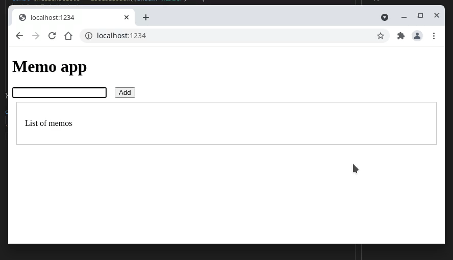

# React Textbook from Modern JavaScript

A hands-on learning repository for React development, following the "Modern JavaScript" textbook curriculum.



[](https://github.com/conao3/book-react-textbook-from-modern-js/blob/master/LICENSE)
[](https://github.com/conao3/book-react-textbook-from-modern-js/releases)

## Overview

This repository contains chapter-by-chapter exercises from the React sections of the "Modern JavaScript" textbook. Each chapter builds on previous concepts to provide a progressive learning path.

## Tech Stack

- **React 17** with TypeScript
- **styled-components** for CSS-in-JS styling
- **Parcel** as the build tool

## Project Structure

```
.
├── chapter4/          # React fundamentals and components
├── chapter5/          # Context API and providers
├── chapter-a/         # Custom hooks and advanced patterns
└── img/               # Demo assets
```

## Getting Started

Navigate to any chapter directory and run:

```bash
yarn install
yarn start
```

## Topics Covered

- **Chapter 4**: Component composition and props
- **Chapter 5**: Context API, AdminFlagProvider pattern
- **Chapter A**: Custom hooks (`useMemoList`), component organization

## Contributing

Contributions are welcome. Feel free to open issues or submit pull requests.

## License

Apache License 2.0

Copyright (c) Naoya Yamashita

See [LICENSE](./LICENSE) for details.

## Author

Naoya Yamashita ([@conao3](https://github.com/conao3))
